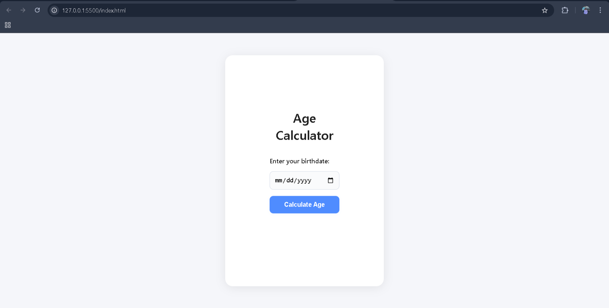

# Age Calculator
A simple, accessible web app to calculate your age in years, months, and days.

## Description
This project lets users enter their birthdate and instantly see their exact age. It features professional UI feedback, accessibility improvements, and clean code structure.

## Screenshots

## How to Run
1. Clone this repo
2. Open `index.html` in your browser

## Features
- Accurate age calculation
- Input validation with error/success styling
- Accessible result area (screen reader friendly)
- Responsive, modern design

## Tech Stack
- HTML5
- CSS3
- JavaScript (ES6)

## Implementation Details

### JavaScript Logic Explained

The core logic is implemented in `js/script.js` and consists of three main parts:

#### 1. Input Validation
- The function `validateInput(dateValue)` checks if the user has entered a birthdate.
- It ensures the date is valid and not in the future.
- Returns an object indicating validity and either the parsed date or an error message.

#### 2. Age Calculation
- The function `calculateAge(birthDate)` computes the difference between the current date and the birthdate.
- It calculates years, months, and days, handling cases where the day or month difference is negative (borrowing from previous months/years).
- Returns an object with the calculated age.

#### 3. Form Handling and UI Feedback
- The form submission is handled by an event listener.
- On submit, input is validated. If invalid, an error message is shown with error styling.
- If valid, the age is calculated and displayed with success styling.
- The result area is accessible and updates dynamically.

### Accessibility & UI
- Error and success messages are styled for clarity.
- The result area is screen reader friendly.
- The design is responsive and modern, ensuring usability across devices.

### Code Structure
- All JavaScript is modular and separated from HTML for maintainability.
- CSS is used for styling and feedback.

> Built for CodeAlpha Internship Portfolio

## Live Demo
[Live Demo](https://your-demo-link.com)

---

